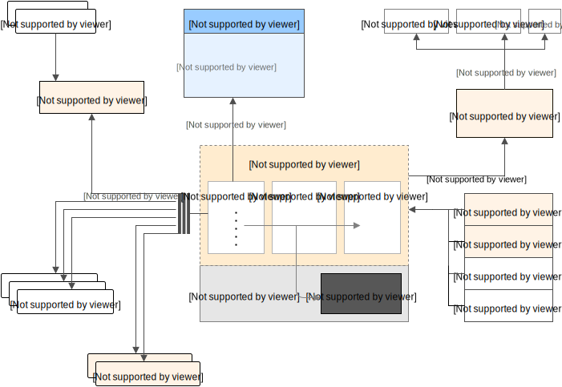

# Descomplicando Prometheus
Respositório criado para o desafio da segunda semana do curso Descomplicando Prometheus da LinuxTips.

# Organização

Este repositório está organizado em três partes:

1. [Tutorial de instalação do Prometheus - Linux](./tutorial/README.md)
2. [Exemplos de arquivos de configuração do Prometheus](./conf/README.md)
3. [Apresentação dos tipos de dados disponíveis no Prometheus](./tipos_de_dados/README.md)

# O que é o Prometheus

Referência: https://quay.io/repository/prometheus/prometheus
